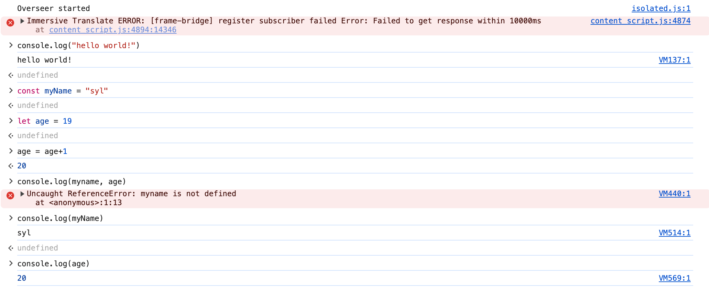
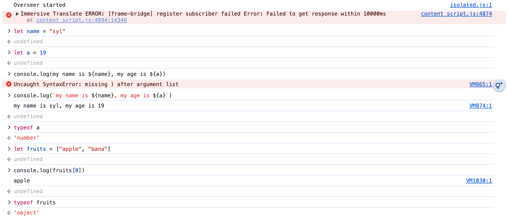
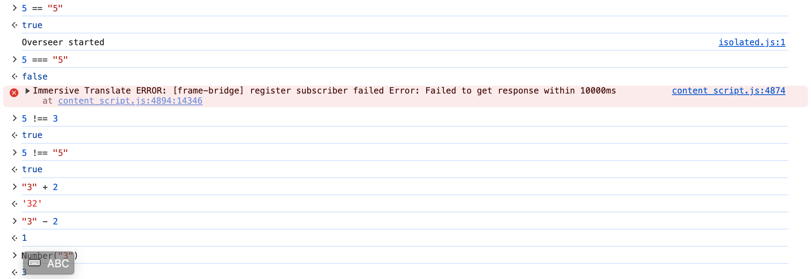
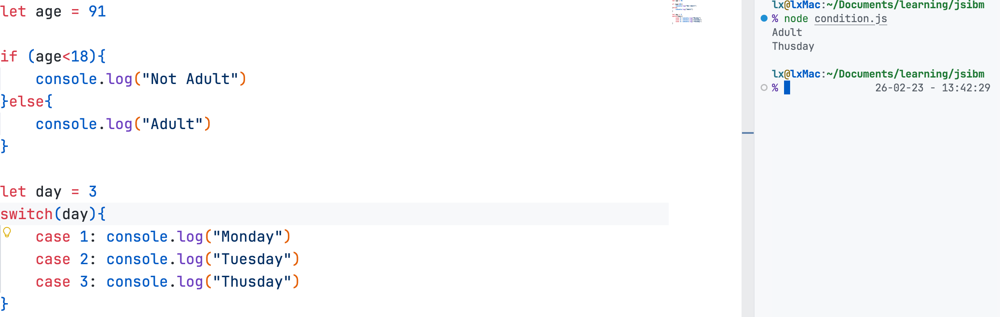
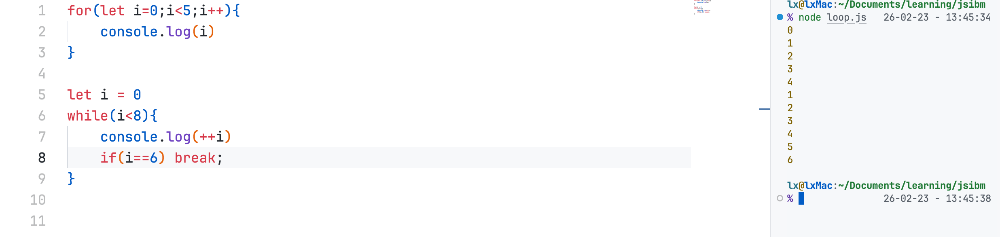
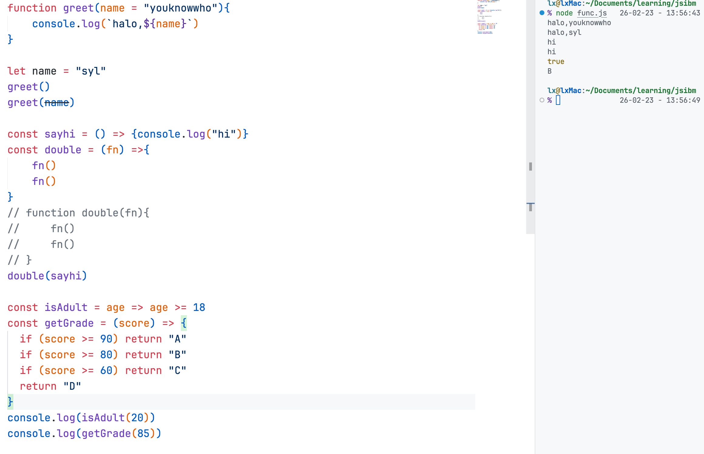
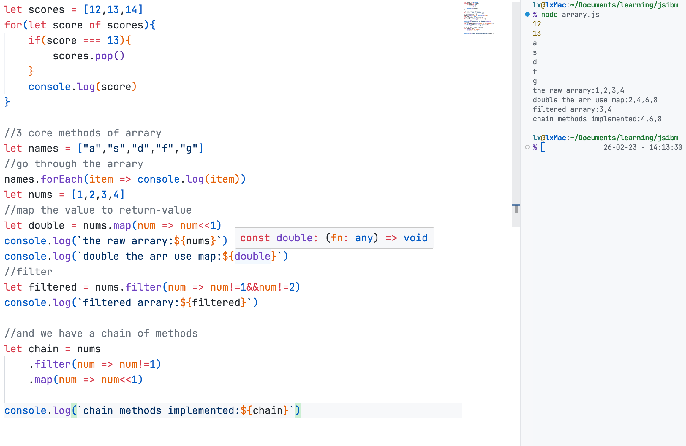
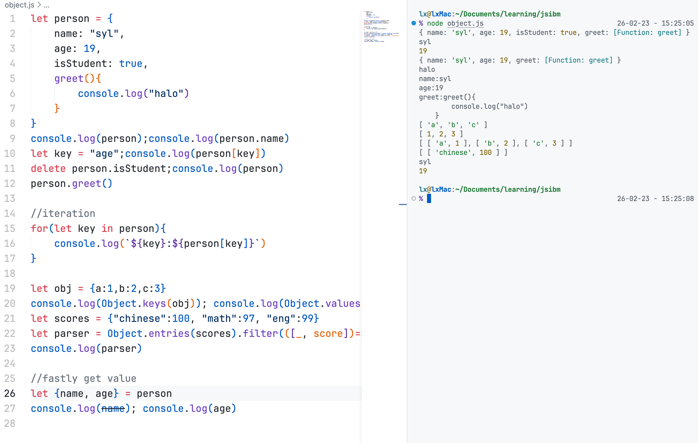
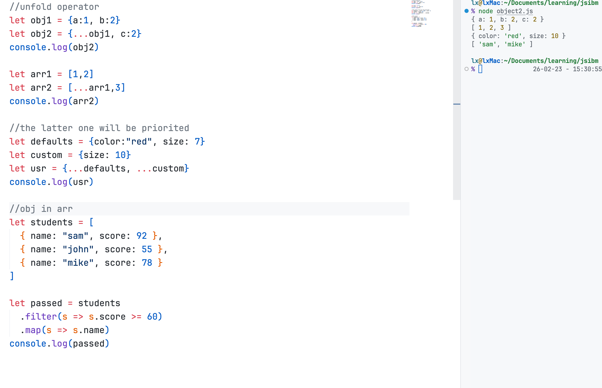

The start of the world!

Know the type and console use
-


Basic Opertions
-

Note that always use "===" and "!=="(compare the value and types)

Condition
-


Loop
-


Func
-


arrary USE
-

we have this method remain to use/learn on my own
```javascript
let arr = [3, 1, 4, 1, 5]

arr.includes(4)           // true，是否包含
arr.indexOf(1)            // 1，第一次出现的下标
arr.find(n => n > 3)      // 4，找到第一个满足条件的
arr.some(n => n > 4)      // true，是否有任意一个满足
arr.every(n => n > 0)     // true，是否全部满足
arr.slice(1, 3)           // [1, 4]，截取（不改原数组）
arr.sort((a, b) => a - b) // [1, 1, 3, 4, 5]，排序
```

Object
-

