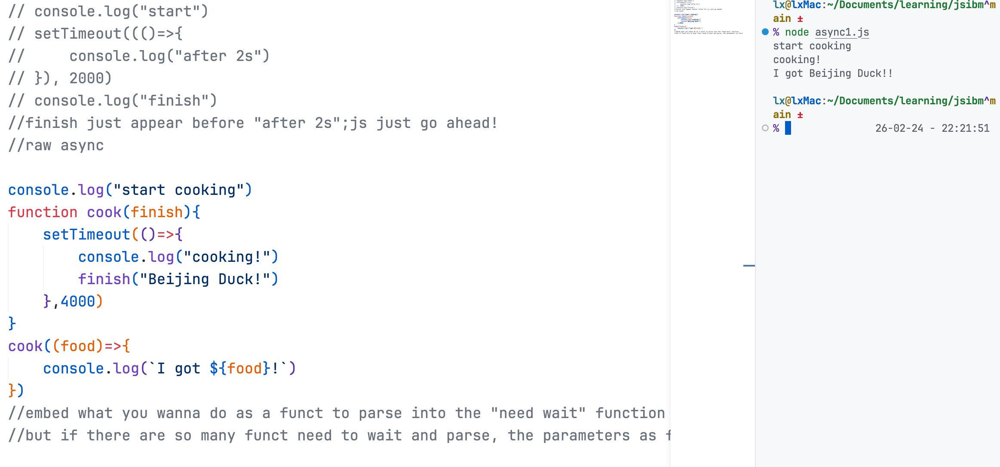
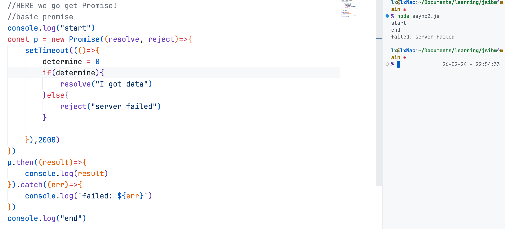

The problem about "wait"
-


promise demo
-


real-annimation
-
```javascript
function getUser(id) {
  return new Promise((resolve, reject) => {
    setTimeout(() => {
      if (id === 1) {
        resolve({ id: 1, name: 'syl' })
      } else {
        reject('failed to find user')
      }
    }, 1000)
  })
}

getUser(1)
  .then((user) => {
    console.log(user.name)
  })
  .catch((err) => {
    console.log(err)
  })

getUser(2)
  .then((user) => {
    console.log(user.name)
  })
  .catch((err) => {
    console.log(err)
  });

function getPosts(userId) {
  return new Promise((resolve, reject) => {
    setTimeout(() => {
        if(userId===2){
            resolve([
                {title: "article1"},
                {title: "article2"}
            ])
        }else{
            reject("failed to find article")
        }
    }, 1000);
  });
}

getUser(1)
  .then((user) => {
    console.log('find user: ' + user.name);
    return getPosts(user.id);       // return a new Promise
  })
  .then((posts) => {
    console.log('his article: ', posts); 
  })
  .catch((err) => {
    console.log(err);   
  });
```
this is the output:
```txt
syl
failed to find user
find user: syl
failed to find article
```